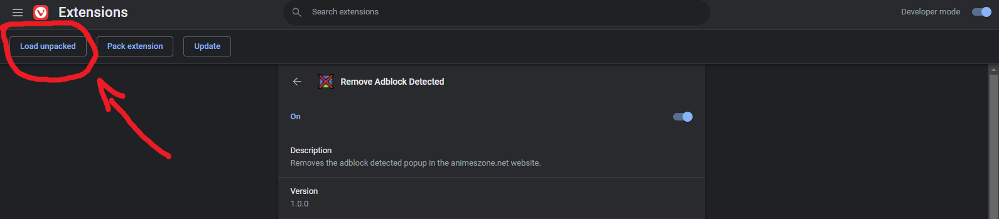

# Remove Adblock Detected 

> I was about to watch some anime and then that pop up just appears... I don't want to disable my adblock because of theirs block trackers, therefore i created it. If you don't have any problem with the trackers and ads, just disable and support the developers. <3

## ⬇ How to install

1. Go to [the releases page](https://github.com/kauefraga/remove-adblockdetected/releases) and install the latest version
2. Open the extensions tab of your browser and look for "load unpacked"

3. Select the installed folder and it's done! 🎉

Feel free to open an issue if there is an error.

## 🧻 Resources

- [Badges](https://badgen.net)
- [Manifest summary](https://developer.chrome.com/docs/extensions/mv3/manifest)
- [How to Create Your Own Google Chrome Extension](https://www.freecodecamp.org/news/building-chrome-extension)
